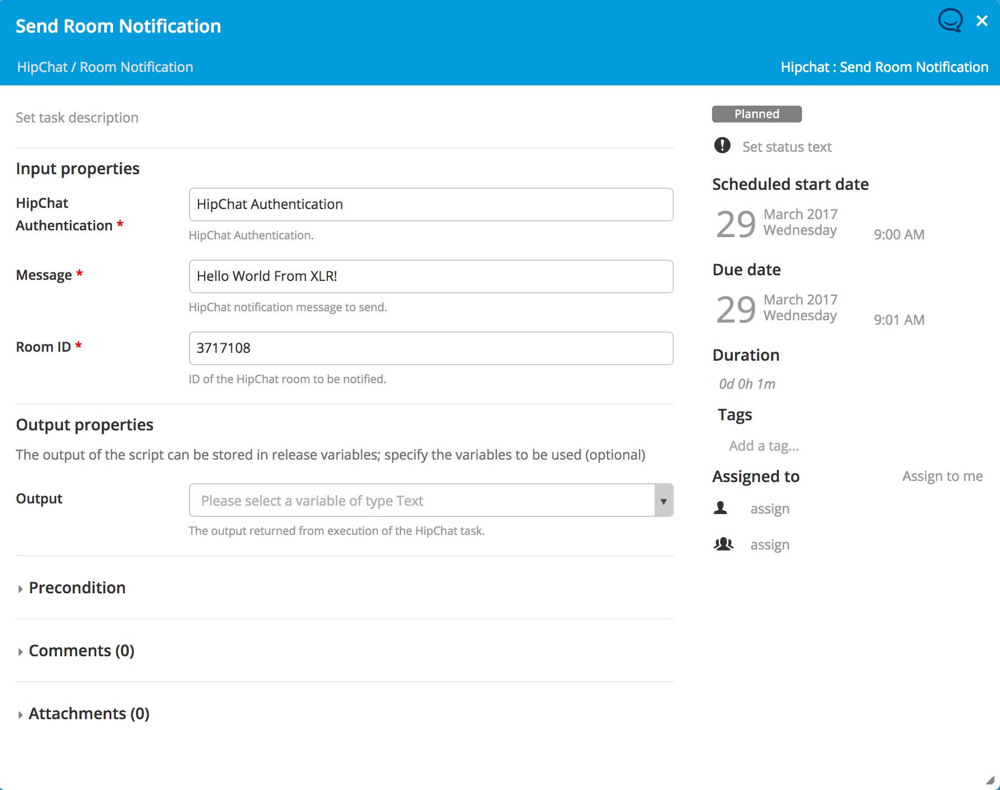

# XLR HipChat Plugin #

## Preface
This document describes the functionality provided by the `xlr-hipchat-plugin`

## Overview
This module offers a basic interface to HipChat functionality.

## Installation
Copy the plugin JAR file into the `SERVER_HOME/plugins` directory of XL Release.

## HipChat Authentication
Configures the credentials used to authenticate with the HipChat REST API. You should use the API access token configured in your[HipChat](https://www.hipchat.com/account/api)account. 

## Available Tasks
The available tasks for interfacing with HipChat. These tasks utilize the HipChat REST API and the provided HipChat Authentication Configuration.

### Send Room Notification
Sends the specified notification message to the specified room.

--- 

## References:
* [HipChat REST API](https://www.hipchat.com/docs/apiv2)
