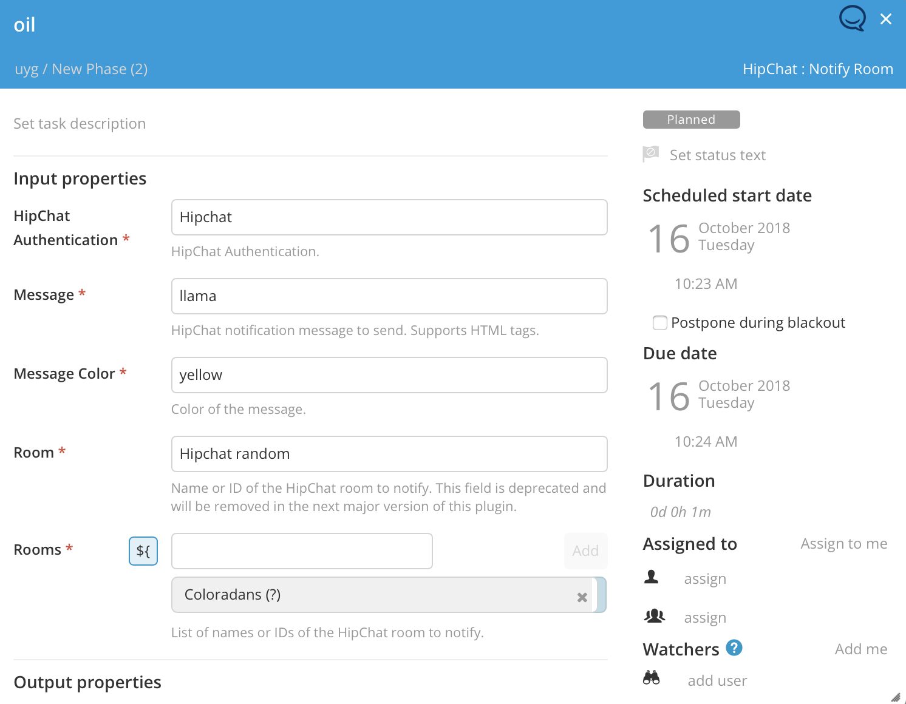

# XLR HipChat Plugin #

[![License: MIT][xlr-hipchat-plugin-license-image]][xlr-hipchat-plugin-license-url]
[![Github All Releases][xlr-hipchat-plugin-downloads-image]]()

[xlr-hipchat-plugin-license-image]: https://img.shields.io/badge/License-MIT-yellow.svg
[xlr-hipchat-plugin-license-url]: https://opensource.org/licenses/MIT
[xlr-hipchat-plugin-downloads-image]: https://img.shields.io/github/downloads/xebialabs-community/xlr-hipchat-plugin/total.svg

## Preface
This document describes the functionality provided by the `xlr-hipchat-plugin`

## Overview
This module offers a basic interface to HipChat functionality.

## Installation
Sewe [here](https://docs.xebialabs.com/xl-release/how-to/install-or-remove-xl-release-plugins.html)

## HipChat Authentication
Configures the credentials used to authenticate with the HipChat REST API. You should use the API access token configured in your[HipChat](https://www.hipchat.com/account/api)account. Note that the token needs to have both the "send_message" and "send_notification" scopes available. 

## Available Tasks
The available tasks for interfacing with HipChat. These tasks utilize the HipChat REST API and the provided HipChat Authentication Configuration.

### Notify Room
Sends the specified notification to a list of specified rooms (name or ID).

### Message User
Sends the specified message to a list of specified users (@ReferenceName, ID, or email).

--- 

## References:
* [HipChat REST API](https://www.hipchat.com/docs/apiv2)
